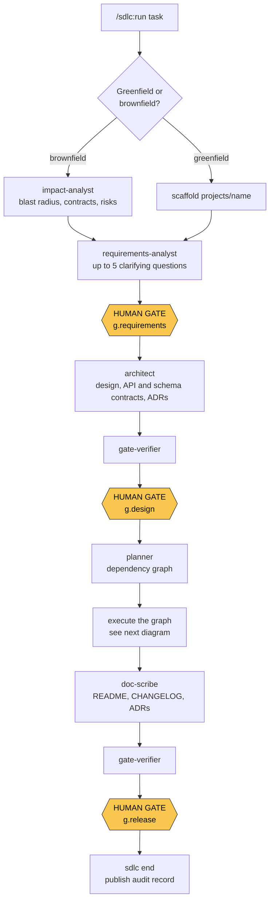
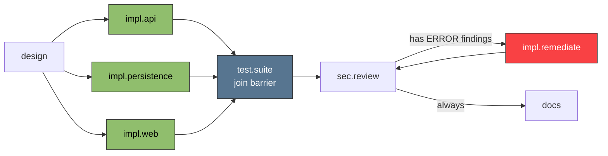
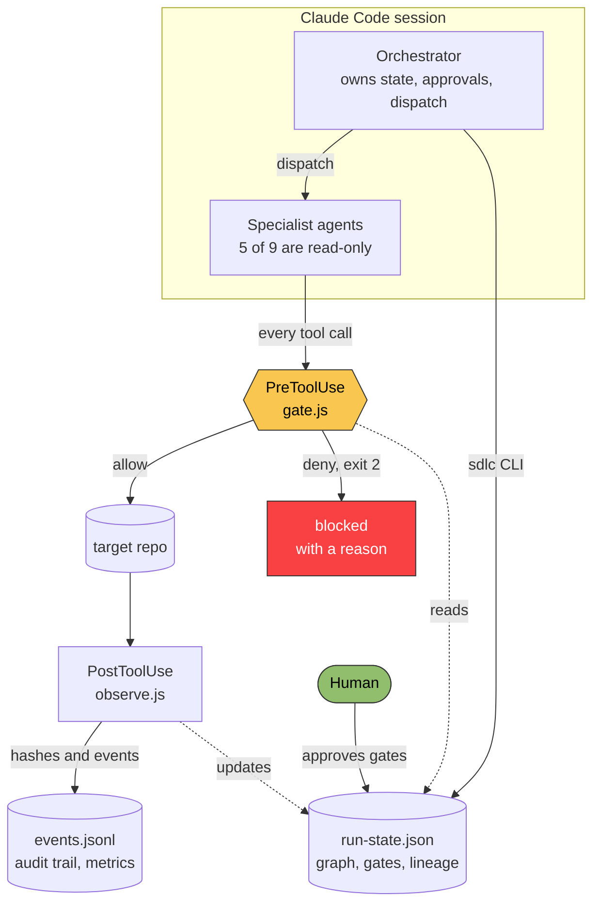

# Agentic Software Engineering System

A Claude Code plugin that runs a **governed SDLC workflow** — requirements, design, implementation, testing, security review, documentation, release readiness — with human approval gates and an audit-grade trail.

It exists because ad-hoc AI coding produces plausible code with no due diligence: no impact analysis before touching an existing system, no record of why anything was decided, and no checkpoint before something risky ships. This makes the lifecycle explicit and enforced, while staying completely out of the way when you are not running it.

**When no run is active, the plugin does nothing.** The gate hook exits immediately and blocks nothing, so day-to-day work is never policed.

---

## What's in this repo

Two things live side by side, and it matters which one you're looking at:

- **The framework itself** — `bin/`, `lib/`, `hooks/`, `skills/`, `agents/`, `config/`, `docs/architecture/`. This is the plugin: the orchestration CLI, the gate policy, the specialist agents, and the design record for why it's built this way.
- **[`projects/url-shortener/`](projects/url-shortener/)** — a real project built and then twice extended by running this framework, unedited by hand afterward except where explicitly noted. Java 21 / Spring Boot backend, React/TypeScript frontend, 250+ tests (unit, slice, and integration against a live Postgres via Testcontainers), 9 ADRs, a full API contract, and a runbook. Its own [README](projects/url-shortener/README.md) covers building and running it standalone.
- **[`artifacts/url-shortener/`](artifacts/url-shortener/)** — the published audit record for three separate runs against it: every gate approval, every node's evidence, the full event log. This is the "audit-grade trail" mentioned above, made concrete. See [Three scenarios](docs/architecture/overview.md#three-scenarios) for what each run demonstrates — greenfield, brownfield, and a deliberately ambiguous request.

---

## The workflow



Three human checkpoints, not seven. Enough oversight to catch a wrong direction early, without interrupting the middle of the work.

---

## Why it is a graph, not a checklist

Execution is driven by a dependency graph that is re-evaluated on every tick, not by a fixed sequence of stages.



- **The green nodes run in parallel.** Nothing orders them, so their agents are dispatched together in one message.
- **`test.suite` is a join barrier.** It waits for all three branches (`joinPolicy: all`; `any` and `quorum:n` also exist).
- **The red branch is conditional.** Its edge condition is literally `results.error_count > 0`, evaluated against the upstream node — so it stays dormant when the scan is clean and activates only when the security review reports findings.

Parallel siblings are safe only because their file scopes are **disjoint**, and the gate hook enforces that — two nodes can never write the same file. If two pieces of work genuinely need the same file, they are not parallel and the planner gives them a dependency instead.

When an upstream artifact changes, content hashing marks dependent nodes `stale` and re-queues them, rather than leaving the run built on something that has since moved.

---

## How governance is actually enforced



Enforcement is split deliberately:

| Deterministic — the hook denies, unarguably | Judgment — `gate-verifier` assesses |
|---|---|
| Destructive commands (`rm -rf`, force-push, `DROP`) | Does the understanding cover the ask |
| Release ops before `g.release` | Is the design adequate |
| High-impact paths before `g.design` | Are the tests meaningful |
| Writes outside the active node's scope | Is a finding genuinely exploitable |
| Any mutation while the run is halted | Was the blast radius fully mapped |
| Edits to the system's own files during a run | |

**A verifier `pass` is necessary but not sufficient.** `sdlc node-pass` independently requires machine evidence — a command that actually ran with exit 0, or a file that actually exists. State cannot advance because an agent said so.

Routine source edits during a run are observed and logged, never blocked. Only high-impact paths — schema, migrations, dependency manifests, CI, infrastructure, auth config, API contracts — require the design gate.

---

## Install

`/plugin` is unavailable in the VSCode extension, so use the `claude` CLI:

```bash
git clone <this repo> C:/Workspace/agentic-software-engineering-system
cd C:/Workspace/agentic-software-engineering-system

claude plugin marketplace add "C:/Workspace/agentic-software-engineering-system"
claude plugin install sdlc@agentic-sdlc
```

Then **required first-time setup** — without it the system has nowhere durable to write and will refuse to start a run:

```bash
node bin/sdlc.js set-home "C:/Workspace/agentic-software-engineering-system"
```

This records the location in `~/.sdlc/config.json`, deliberately outside the plugin. The plugin installs as a **versioned copy** in `~/.claude/plugins/cache/` that is replaced on every update, so anything durable kept inside it would be destroyed by a routine upgrade. `set-home` refuses a path inside the plugin install for that reason.

Verify, then **restart Claude Code**:

```bash
node bin/sdlc.js home
claude plugin list
```

Requires Node 18+ (the hooks are dependency-free Node) and, for generated Java projects, JDK 21 and Maven.

---

## Usage

```bash
# Greenfield — scaffolds projects/<name>/ and registers it
/sdlc:run Create a URL shortener service from scratch

# Brownfield — against a registered repo
/sdlc:run --project billing Fix the invoice rounding bug

# Force a track
/sdlc:run --track express Fix the typo in the login error message
```

Register an existing codebase once before using it:

```bash
node bin/sdlc.js register billing --path "C:/Workspace/billing" --stack java-spring
```

Or use `/sdlc:bootstrap`, which also detects the build commands and writes repo-specific rules.

### Tracks

| Track | For | Human gates |
|---|---|---|
| `express` | Isolated bugfix, typo, known cause | `g.requirements` |
| `standard` | Feature work, new services, refactors (default) | `g.requirements`, `g.design`, `g.release` |
| `regulated` | Payments, PII, access control — anywhere an auditor will ask | All eight stages |

### The three gates

| Gate | You are approving | It unlocks |
|---|---|---|
| `g.requirements` | The restated understanding, your answers, the assumptions being carried | Design work |
| `g.design` | Architecture, contracts, ADRs, task breakdown | Schema, migrations, dependencies, CI, infra, auth, API contracts |
| `g.release` | Build and tests green with exit codes, no unwaived ERROR findings, rollback path | Push, merge, publish, deploy, tag |

### When a run halts

A node that exhausts its retry budget halts the run, and **every mutation is then denied**. Three failures usually means the plan is wrong, not the code.

```bash
node bin/sdlc.js status              # why it halted
node bin/sdlc.js approve --resume    # once the cause is actually fixed
```

Never work around a halt. If you are looking for another way to make the same write, the gate is telling you something the run state already knows.

---

## CLI reference

The orchestrator drives runs through this; you mostly need `set-home`, `home`, `status`, `approve` and `list`.

```
set-home <path>      One-time: where projects and audit records live
home                 Show resolved paths
init --task "<task>" [--project <name>] [--mode greenfield|brownfield]
                     [--profile express|standard|regulated] [--path <repo>]
plan-load <graph>    Load a planner-produced node graph into the run
status               Graph, gates, and what is ready now
advance              Recompute the ready set
approve <gate> [--by <who>] [--artifact <path>] [--waive --reason "<why>"]
approve --resume     Clear a halt
node-start <id>
node-pass  <id> --evidence-cmd "<cmd>" --exit 0 | --evidence-artifact <path> [--results '<json>']
node-fail  <id> --error "<what went wrong>"
halt [--reason "<why>"]
end [--failed]       Close the run and publish the audit record
register <name> --path <abs-path> [--type brownfield] [--stack <stack>]
list
```

Flags are `--key value` or bare `--key`. **`--key=value` is not supported** and will parse wrong. All commands accept `--project <name>` to disambiguate when several runs are active.

---

## Tuning

Behaviour is data, not logic. Change these rather than `lib/`:

| File | Controls |
|---|---|
| `config/policy.default.json` | Risk tiers, destructive patterns, release ops, retry budgets, protected zone |
| `config/profiles.json` | Which gates each track requires |
| `~/.sdlc/config.json` | Your overrides — survives plugin updates |
| `<target repo>/.sdlc/policy.json` | Per-repo overrides |
| `agents/*.md`, `skills/*/SKILL.md` | What each specialist does |

`SDLC_MODE=advisory` downgrades every denial to a log entry, for when the system is in the way and you need to ship.

**The edit loop:** the plugin installs as a commit-pinned copy, so editing this repo does not change behaviour until you publish it.

```bash
# edit, then
git commit -am "tune policy"
claude plugin update sdlc
# restart Claude Code
```

The system's own files are read-only while a run is active — tune between runs, not during one.

---

## Layout

```
.claude-plugin/   Plugin and marketplace manifests
agents/           9 specialist subagents
skills/           5 skills; run/references/ loads on demand
hooks/            gate.js (enforce), observe.js (audit), session.js (state digest)
lib/              policy, scheduler, state, paths, events, hash — pure and unit-tested
bin/sdlc.js       Orchestration CLI
config/           Policy, profiles, project registry
schemas/          Run-state and event contracts
projects/         Generated codebases
artifacts/        Published audit records, one directory per run
docs/architecture Design record and ADRs
```

Hot run state lives in `~/.sdlc-data` (per-machine, never committed). Durable audit records are published to `artifacts/` at gate transitions and at run end.

## Tests

```bash
node --test tests/
```

99 tests: the gate decision table, the glob engine, scheduler join policies and conditional edges, graph validation, path resolution, plus integration tests that spawn the real hook as a subprocess and assert exit codes.

## Not built yet

- Automated rollback and git worktree isolation (use a node's `writeManifest` and version control meanwhile)
- Reliability metrics reporting (`events.jsonl` already captures the data)
- Semgrep wiring — deliberately unwired; see `.mcp.json` for why, and prefer the Docker CLI
- The `rules/` coding-standard files for Java/Spring and React

See `docs/architecture/overview.md` for the design rationale and `docs/architecture/adr/` for the decisions behind it.
